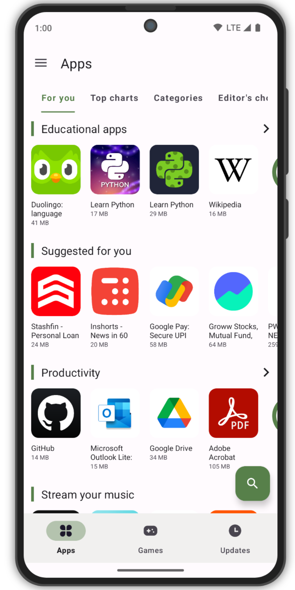
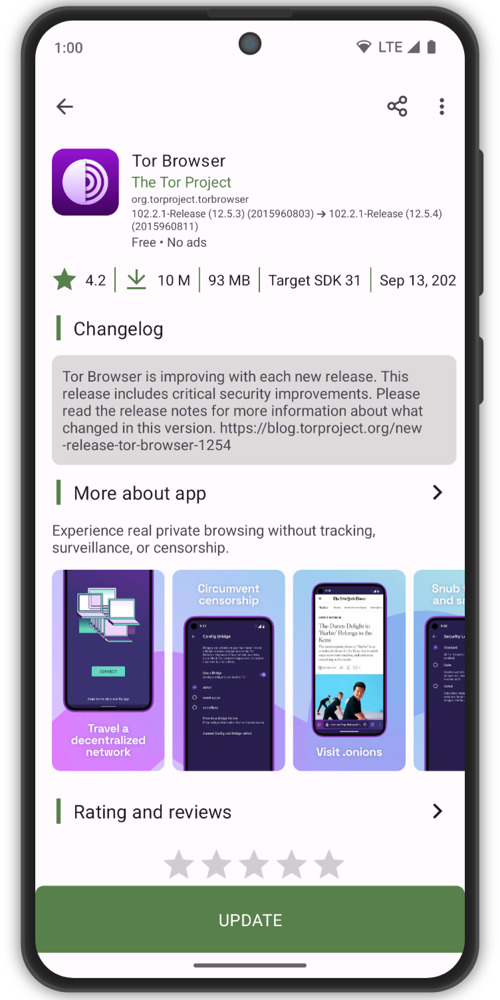
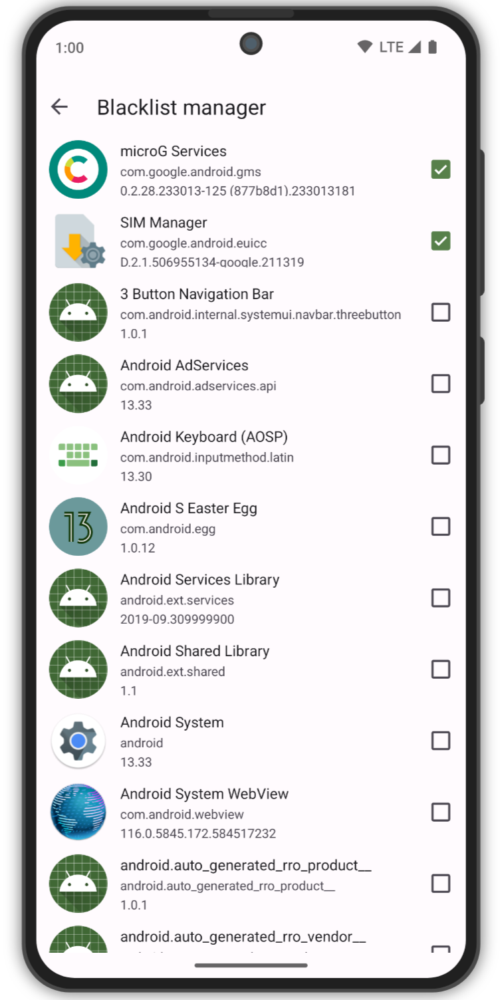
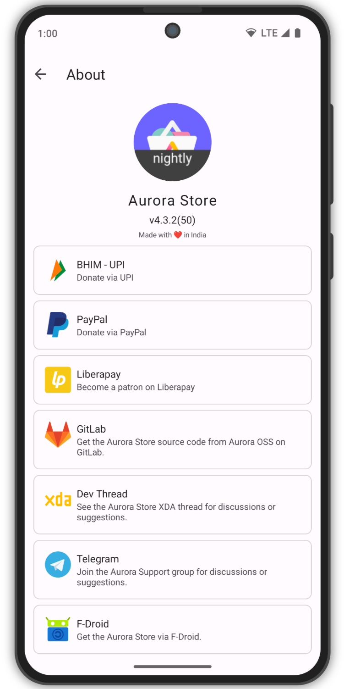

# Aurora Store

**Aurora Store** is an unofficial, FOSS client to Google Play with bare minimum features. Aurora Store
allows users to download, update, and search for apps like the Play Store. It works perfectly fine
with or without Google Play Services or MicroG.

## Features

- FOSS: Has GPLv3 licence
- Beautiful design: Built upon latest Material 3 guidelines
- Account login: You can login with either personal or an anonymous account
- Device & Locale spoofing: Change your device and/or locale to access geo locked apps
- [Exodus Privacy](https://exodus-privacy.eu.org/) integration: Instantly see trackers in app
- Updates blacklisting: Ignore updates for specific apps
- Download manager
- Manual downloads: allows you to download older version of apps, provided
  - The APKs are available with Google
  - You know the version codes for older versions 

## Limitations

- Underlying API used is reversed engineered from PlayStore, changes on side may break it.
- Provides only base minimum features
  - Can not download or update paid apps.
  - Can not update apps/games with [Play Assset Delivery](https://developer.android.com/guide/playcore/asset-delivery)
- Multiple in-app features are not available if logged-in as Anonymous.
  - Library
  - Purchase History
  - Editor's Choise
  - Beta Programs
  - Review Add/Update
- Token Dispenser Server is not super reliable, downtimes are expected.  

- [XDA Developers](https://forum.xda-developers.com/t/app-5-0-aurora-store-open-source-google-play-client.3739733/)

## Screenshots

## Translations

Don't see your preferred language? Click on the widget below to help translate Aurora Store!

## Project references

Aurora Store is based on these projects

- [YalpStore](https://github.com/yeriomin/YalpStore)
- [AppCrawler](https://github.com/Akdeniz/google-play-crawler)
- [MY resume](https://github.com/elonmasai7/aurora_store)
- [Raccoon](https://github.com/onyxbits/raccoon4)
- [SAI](https://github.com/Aefyr/SAI)
